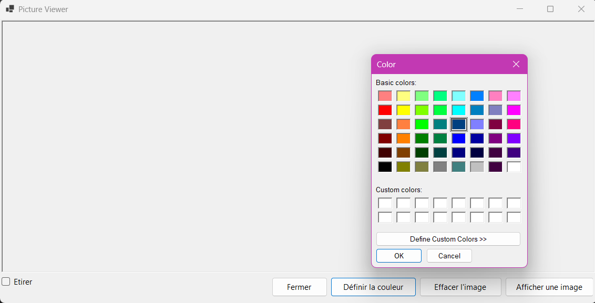
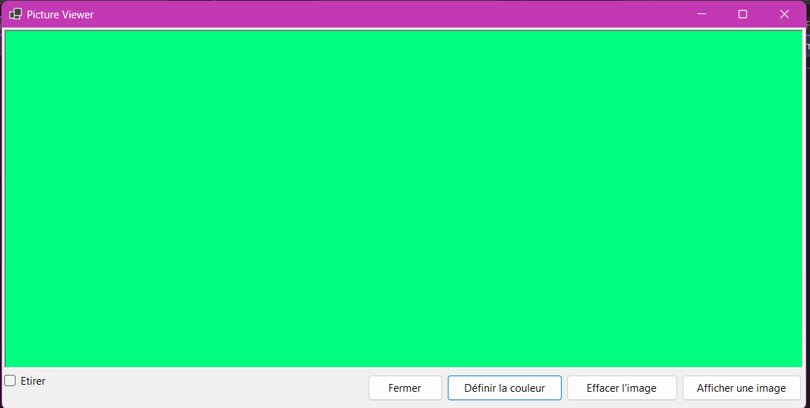

# Activité 6 - Picture Viewer 🖼️

## Description 📜

Ce projet est une application Windows Forms développée en C# permettant de visualiser des images avec plusieurs options interactives. L'application permet à l'utilisateur de :

- Afficher une image de son choix à partir de son ordinateur 🖼️.
- Modifier la taille de l'image via une case à cocher pour l'étirer ou l'afficher dans sa taille d'origine 🔲.
- Changer la couleur de fond de l'image 🎨.
- Fermer l'application ❌.

## Fonctionnalités ⚙️

- **Afficher une image** : L'utilisateur peut choisir une image au format `.jpg` ou `.png` à l'aide d'un sélecteur de fichier intégré 🗂️.
- **Effacer l'image** : Permet de supprimer l'image affichée dans le `PictureBox` 🧹.
- **Définir la couleur de fond** : Permet de sélectionner une couleur pour l'arrière-plan de l'image à l'aide d'un sélecteur de couleur 🎨.
- **Étirement de l'image** : Une case à cocher permet de modifier le mode d'affichage de l'image, en la redimensionnant pour occuper toute la zone disponible ou en la conservant à sa taille d'origine 📏.
- **Fermeture de l'application** : Un bouton permet de fermer proprement l'application 🚪.

## Installation ⚡

1. Clonez ce projet ou téléchargez les fichiers source 📥.
2. Ouvrez le projet dans Visual Studio 🖥️.
3. Assurez-vous d'avoir .NET Framework installé sur votre machine 📦.
4. Compilez et exécutez le projet 🚀.

## Prérequis 🛠️

- [Visual Studio](https://visualstudio.microsoft.com/) avec prise en charge de C# et Windows Forms 💻.
- .NET Framework (version compatible selon votre version de Visual Studio) 🖥️.

## Fonctionnement 🎮

1. **Afficher une image** : Cliquez sur le bouton "Afficher une image" et sélectionnez un fichier image de votre choix 📂.
2. **Effacer l'image** : Cliquez sur "Effacer l'image" pour retirer l'image du `PictureBox` 🚫.
3. **Changer la couleur de fond** : Cliquez sur "Définir la couleur" pour ouvrir un dialogue de sélection de couleur et choisir un fond personnalisé pour l'image 🎨.
4. **Étirer l'image** : Cochez la case "Étirer" pour étirer l'image en fonction de la taille de la fenêtre 🔲.
5. **Fermer l'application** : Cliquez sur "Fermer" pour quitter l'application 🚪.
## Capture d'écran 📸

