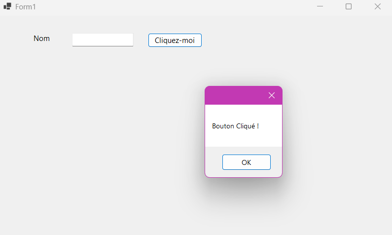

# Activité 7 - Bonnes Pratiques : "Les touches d'accès" 🖱️⌨️

## Description 📜

Cette activité permet de comprendre l'utilisation des touches d'accès clavier dans une application Windows Forms. L'objectif est de créer un formulaire avec des contrôles de base, puis de tester l'activation de ces contrôles en utilisant uniquement le clavier, sans avoir besoin de la souris.

## Fonctionnalités ⚙️

### 1. Création du formulaire de base 🖥️

Le formulaire contient :
- **Un bouton** avec la propriété `Text = "&Cliquez-moi"`.
- **Une étiquette** avec le texte `Text = "&Nom :"` et `TabIndex = "5"`.
- **Un champ de texte** avec `TabIndex = "6"`, permettant à l'utilisateur de saisir un nom.

### 2. Ajout d'un événement simple 🔧

Lorsque l'utilisateur clique sur le bouton, un message `"Bouton Cliqué !"`, s'affiche. Cet événement est déclenché en appuyant sur le bouton, et son activation est testée via les touches d'accès.

### 3. Tests pratiques 🧪

#### Scénario 1 :
- **Étapes** : Placer le focus sur le `TextBox`, puis appuyer sur `Alt+C`.
- **Résultat attendu** : Le bouton `"Cliquez-moi"` est activé.
  
#### Scénario 2 :
- **Étapes** : Cliquer en dehors des contrôles, puis appuyer sur `C`.
- **Résultat attendu** : Le bouton est activé directement sans avoir à utiliser `Alt`.

#### Scénario 3 :
- **Étapes** : Appuyer sur la touche `N`.
- **Résultat attendu** : Le focus se déplace automatiquement vers le champ de texte (`TextBox`), et l'utilisateur peut saisir un nom sans utiliser la souris.

### 4. Remarques 📝

- **Comportement des touches d'accès** :
    - Lorsque le `TextBox` est en focus, l'appui sur `Alt` permet de combiner l'utilisation de la touche `C` avec la touche `Alt` pour activer le bouton. Si le focus est ailleurs, la touche `C` active directement le bouton sans avoir besoin de la touche `Alt`.

- **Touches d'accès sans souris** :
    - Il est important de noter que les touches d'accès fonctionnent même sans souris. Cela permet aux utilisateurs d'interagir uniquement via le clavier, ce qui est particulièrement utile pour les personnes ayant des limitations motrices.

## Capture d'écran 📸

