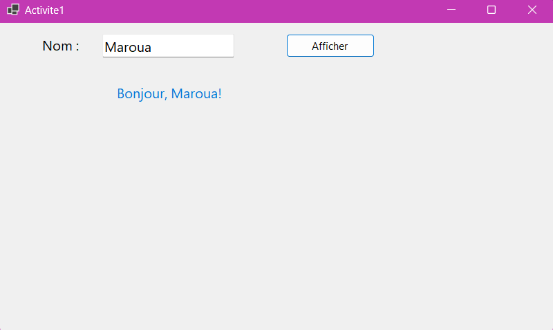
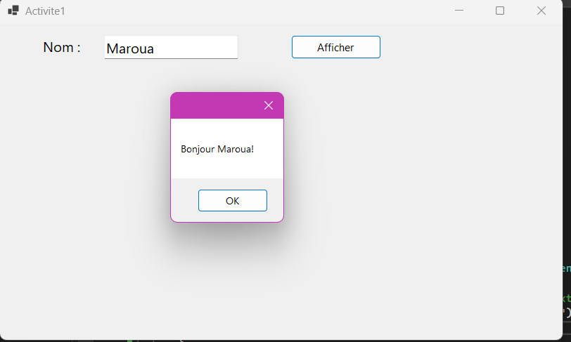
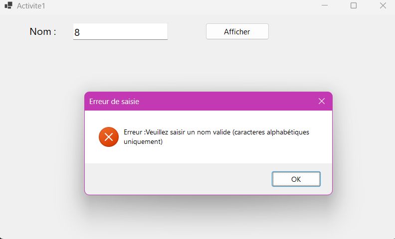
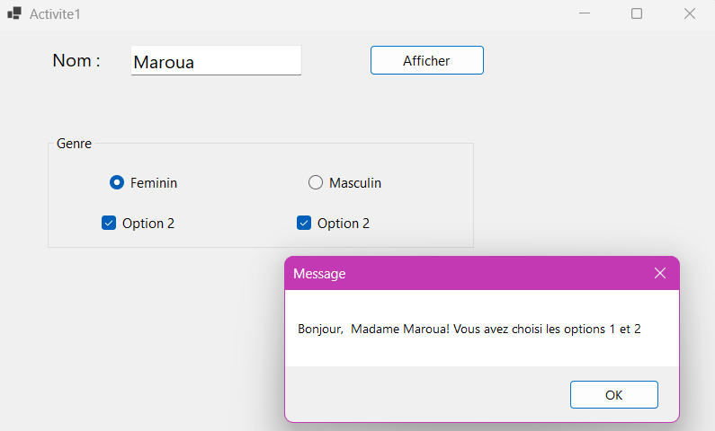
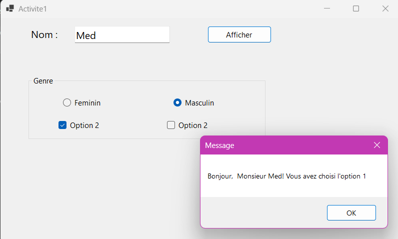

# 📋 Application de Formulaire - TP2

## Description 📝

Cette application est un formulaire Windows Forms en C# qui permet à l'utilisateur de saisir son nom et de sélectionner des options. Selon les choix effectués, un message personnalisé sera affiché. 

### Fonctionnalités principales ✨
- Saisie du nom avec validation des caractères (seulement lettres et espaces sont autorisés).
- Sélection du genre via des boutons radio (Masculin / Féminin).
- Sélection d'options via des cases à cocher (Option 1 et Option 2).
- Un message s'affiche en fonction des choix effectués par l'utilisateur.

---

## Fonctionnement 🔧

1. **Nom** : L'utilisateur saisit son nom dans un champ de texte. Si le nom contient des caractères non valides (autres que des lettres ou des espaces), une erreur sera affichée.
2. **Genre** : L'utilisateur peut sélectionner son genre en choisissant entre le bouton "Masculin" ou "Féminin".
3. **Options** : Deux cases à cocher sont disponibles. Si les deux sont sélectionnées, un message indique que les deux options ont été choisies.
4. **Afficher** : Après avoir saisi son nom et effectué les sélections, l'utilisateur clique sur le bouton "Afficher" pour afficher un message personnalisé dans une fenêtre pop-up.

---

## Exemple d'utilisation 🖥️

1. Saisissez un nom valide, comme **Alice**.
2. Sélectionnez "Feminin" ou "Masculin".
3. Cochez une ou plusieurs options.
4. Cliquez sur le bouton **Afficher** pour voir le message.

---

## Dépendances 📦

- .NET Framework 4.8 ou supérieur
- Visual Studio 2019 ou supérieur

---

## Code

Le code source est réparti entre deux fichiers principaux : 

- **Form1.cs** : Le fichier principal où l'interface utilisateur et les actions sont gérées.
- **Form1.Designer.cs** : Le fichier contenant la configuration de l'interface utilisateur, avec la définition des éléments graphiques tels que les boutons, les labels, et les checkboxes.

---

## Capture d'écran 📸

Voici à quoi ressemble l'interface de l'application :

---

